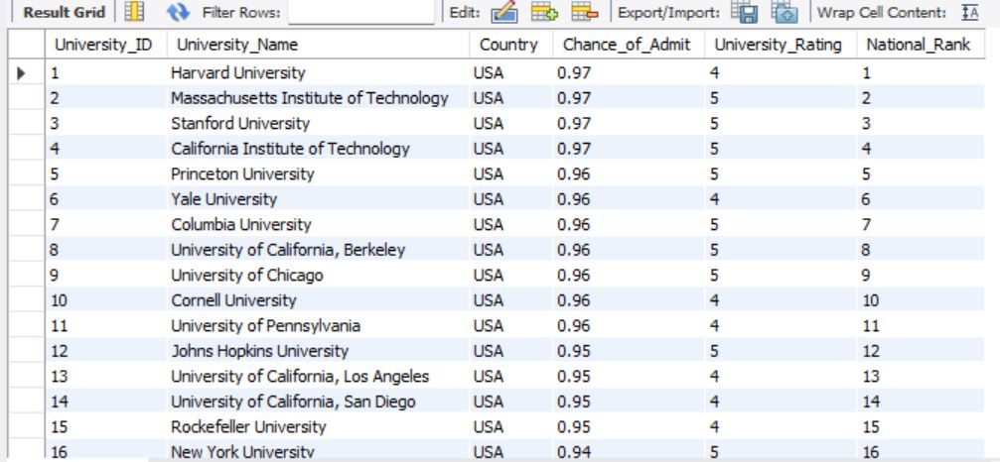
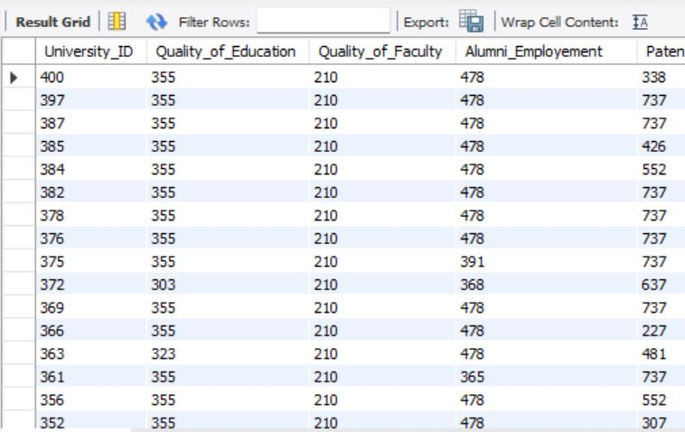
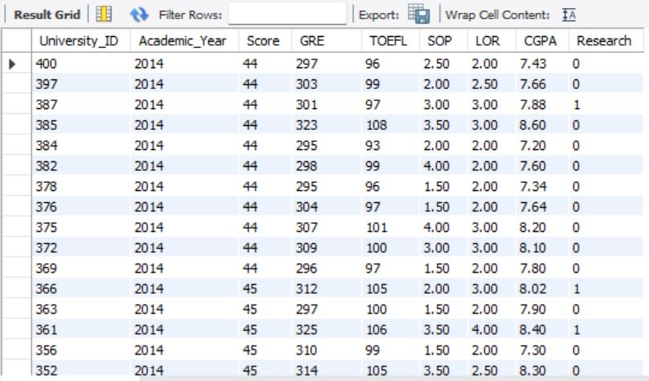
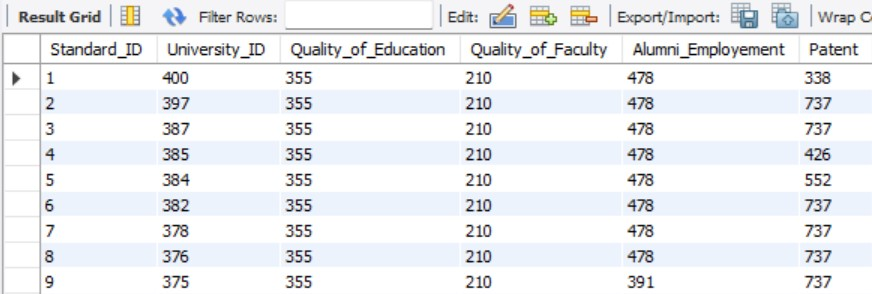
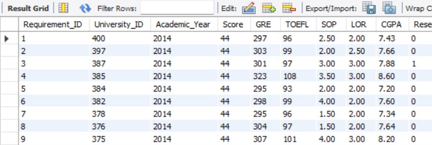

# DMDD_Assignment4

Our database contains 3 tables University, Requirements and Standards 

## First Normal Form (1NF) :

University table has a primary key on University_Id but the other two tables : Standards and Requirements do have primary key and hence are not in 1NF. 

We have created a column in Standards table name Standard_ID and Requirement_ID in Requirements table.

These newly created columns are the primary key of their respective tables.

All the columns of all the tables are atomic. There are no multiple values stored in a single column of the table.

All the columns store distinct information and contribute to the dataset in its own unique way.

And hence all the tables are now in 1NF

Hence the tables in the database are in 1NF.

## Second Normal Form (1NF) :

•	The table qualifies to be in the first normal form.

•	No columns in all the tables are dependent on each other and hence there is not partial dependency in the dataset. The columns in the tables are not retrieved from any of the other column.

•	University table :- University_name, Chance_of_Admit, university_rating etc are not dependent on each other.

•	Requirements table:- academic_year, Score, GRE, TOEFL, SOP, LOR CGPA are not dependent on each other.

•	Standards table:- Quality_of_Education, Quality_of_Faculty, Alumni_Employement are independent are there is no partial dependency.

•	The values of any column from all the table cannot be retrieved from any other column.

•	Hence the tables in the database are in 2NF.

## Third Normal Form (3NF):.
•	The table qualifies to be in the second normal form.

•	Transitive dependency: A transitive dependency in a database is an indirect relationship between values in the same table that causes a functional dependency

In our database, 
1)	University table:  University_name, Chance_of_Admit, university_rating are the columns. University_name determins the chance of admit. If we know the university name, we will retrieve chance if admit. But if we have chance of admit we cannot retrieve university_name from it.
Similarly, University_name can determine university_ratrung. But we cannot retrieve eniversity_name from university_satring.
2)	Standards table: University_id, Quality_of_Education and  Quality_of_Faculty. University_id determines the quality_of_education. If we have university_id we can retrieve quality_of_education. But we cannot retrieve university_id from quality_of_education.
Similarly, for other columns, there is no transitive dependency.
3)	Requirements: academic_year, Score, GRE, TOEFL, SOP, LOR CGPA.
We can retrieve each of these columns form the university_id but we cannot retrieve university_if from these columns. 

Hence these tables are free of transitive dependency and are in 3NF. 

